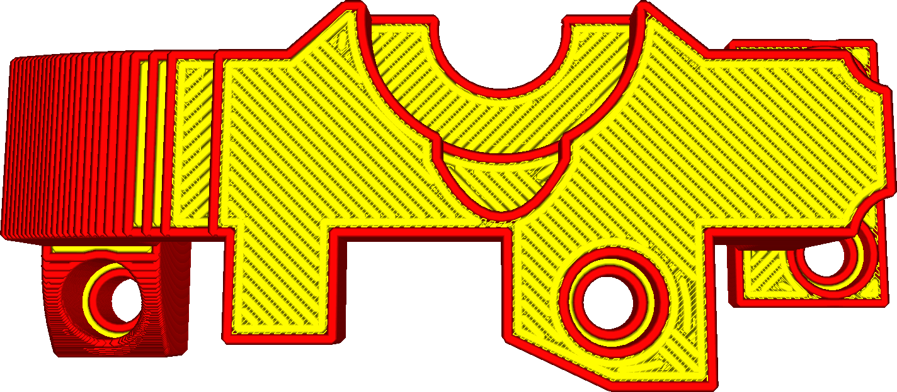

Расстояние между линиями разглаживания
====
Данный параметр изменяет расстояние между каждой линией созданным режимом "Разрешить разглаживание". Линии разглаживания обычно должны быть ближе друг другу, чем все другие линии созданные для модели. В общем этот параметр является ключевым в создании качественного разглаживания верхних слоев.

* Увеличение расстояния между линиями сокращает время печати.
* Уменьшение расстояние позволяет делать верхнюю поверхность качественнее.