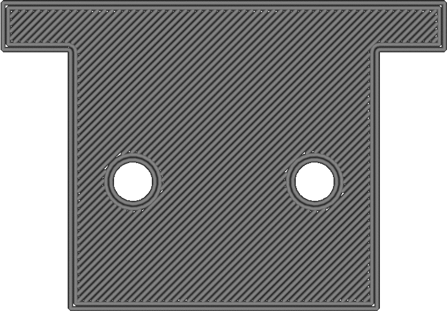

Печать внешней стенки
====
Данный параметр отвечает за то, какие стены напечатаются первыми, внешние или внутренние.

Включение этого параметра оказывает следующие влияние, связаное  качеством и прочностью деталей:

* Улучшение точности деталей. Обычно стенки при укладки толкают друг друга и это особенно видно когда ширина линии меньше диаметра сопла. Первая из напечатанных стен может успеть затвердеть до того как будет рядом положена еще одна. В этом случае затвердевшая стена уже не будет вытеснена положенной новой линией. Поэтому печать внешней стенки первой делает ее более точной
* Если у вас заполнение детали печатается первым, затем внутренние стенки и наконец внешняя стена, то в таком случае шаблон заполнения может быть виден через внешние стенки детали. Вы можете печатать сначала заполнение, потом внешнюю стенку, потом  внутренние стенки. Таким образом внешняя стенка успеет затвердеть до того как внутренняя стенка повлияет на качество внешней поверхности.
* Печать внешних стен хуже всего подходит для нависающих элементов. Внешняя стена будет печататься на весу и нет соседних опор чтобы ее поддержать ее. Если для навесов печатать сначала внутреннюю стенку, а затем внешнюю, внутренняя стенка не будет давать падать линиям внешней стенки вниз.
