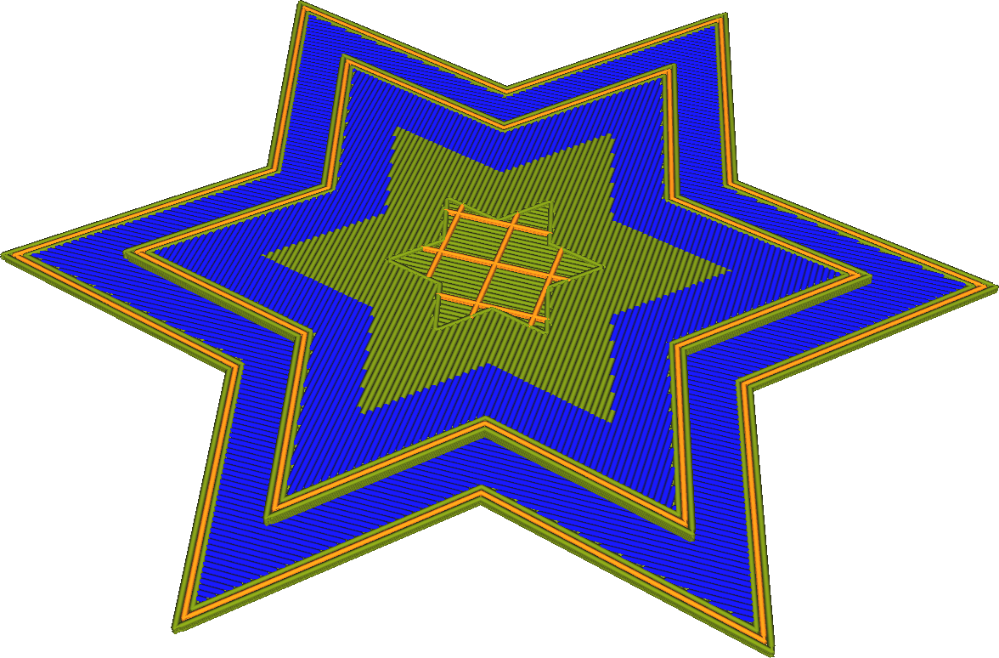

Слои верхней оболочки
====
Данная настройка позволяет задавать количество слоев самой верхней оболочки. Сколько же еще будет настроек для верхних слоев оболочки?

Некоторые параметры могут быть отдельно изменены. 

Например: верхние слои лучше печатать с упором на качество, поэтому лучше снизить скорость для верхней оболочки. Для остальных слоев скорость печати можно увеличить, на внешнем виде этого практически не будет заметно.

А вот еще несколько настроек, которые позволяют задавать отдельные параметры для верхних поверхностей.
* [Экструдер для печати крышки](../shell/roofing_extruder_nr.md)
* [Поток для внешней оболочки](../../../articles/material/roofing_material_flow.md)
* [Скорость верхней оболочки](../../../articles/speed/speed_roofing.md)
* [Ускорение верхней оболочки](../../../articles/speed/acceleration_roofing.md)
* [Рывок верхней оболочки](../../../articles/speed/jerk_roofing.md)
* [Ширина линии крыши](../../../articles/experimental/roofing_line_width.md)
* [Шаблон верхней оболочки](../../../articles/experimental/roofing_pattern.md)
* [Направление линий верхней оболочки](../../../articles/experimental/roofing_angles.md)

Чтобы добиться лучшего результата верхних оболочек, попробуйти уменьшить скорость и увеличить рывок.

Чтобы цвет печати нижних слоев никак не повлиял на верхнюю оболочку(если вы поменяете [Экструдер для печати крышки](../roofing_extruder_nr.md)) с другим цветом, попробуйте увеличить количество верхних слоев. 
