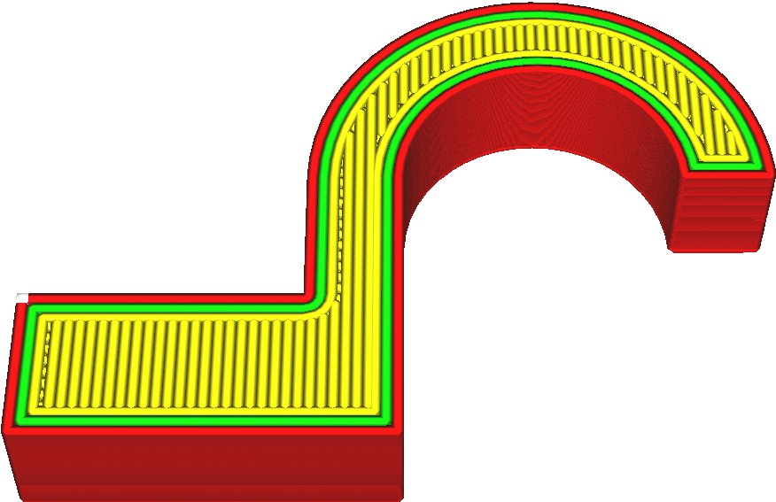

Направление линий дна/крышки
====
В этом параметре можно установить направление линий в котором они будут печататься через запятую

По умолчанию шаблон линий печатается в двух диагональных направлениях. Для декартовых принтеров этот тип линий укладывается точнее, поскольку задействованы сразу оба двигателя (X и Y). Такое взаимодействие позволяет лучше управлять движением сопла при повороте на следующую линию.

Причины, по которым приходится менять направление движения:
* Для достижения другого визуального эффекта.
* Улучшение технических свойств детали (оптимизация сил). Напечатанная деталь как правило получится более крепкой и устойчивой к разным родам нагрузок в различных направлениях. Появляется устойчивость к нагрузкам на растяжение, изгиб или деформацию параллельно линиям уложенных шаблоном.
* Улучшение печати навесов детали. Если деталь достаточно тонкая, можно печатать линии только в одном направлении. Для мостов линии в одном направлении могут сэкономить немного материала, так как не придется тратить пластик на заполнение. Тоже самое получится если выбрать линии направления крышки перпендикулярно заполнению.
* Оптимизация движений для принтеров с системой H-bot, Core-XY или Delta-Printer.

Направление будет меняться на каждом следующем слое согласно указанным значениям циклически. Для примера, числа "[0, 30, 60]" будут означать, что первый слой дна/крышки будет положен с направлением 0 градусов, следующий слой отклонением 30 градусов от оси X, третий с отклонением 60 градусов. 
