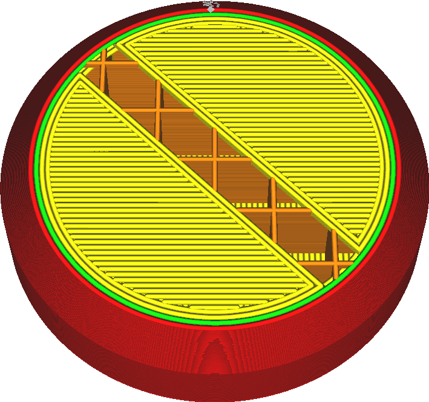

Количество внешних дополнительных оболочек
====
Когда печатается крышка и дно детали с шаблонами линий, последний слой может быть напечатан с дополнительными контурами. Эта настройка очень похожа на настройку чередующей стенки, но в том случает дополнительная стенка ставится между заполнением и внешними стенками. 

Обычно линии оболочки укладываются без дополнительных контуров, но конечные точки линий могут провисать. Если имеется какие-нибудь дополнительные стенки оболочки, то принтер сначала сделает периметр вокруг этих оболочек, потом будет печатать линии к которые будут хорошо крепиться к периметру. Оболочка не будет сильно провисать в конечных точках. К тому же это делает качество поверхности немного лучше.

