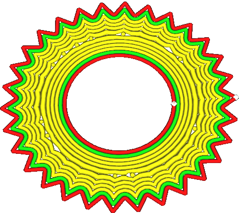

Нижний шаблон начального слоя
====
Этот параметр будет определять тип шаблона для первого слоя. Шаблон настраивается отдельно от остальных нижних слоев

Концентрический шаблон имеет лучшую тенденцию прилипать к поверхности стола в отличии от остальных типов. При усадке материала внутренние напряжения с использованием этого шаблона распределяются равномернее. Это предотвращает загибание частей детали и повышает общую надежность в 3д печати. Остальные шаблоны рисуют линии в одном направлении.

При печати на плоту рисунок линями дает больше преимуществ. Шаблон линии будет хорошо перекрывать промежутки линий плота, создавая более гладкую поверхность.