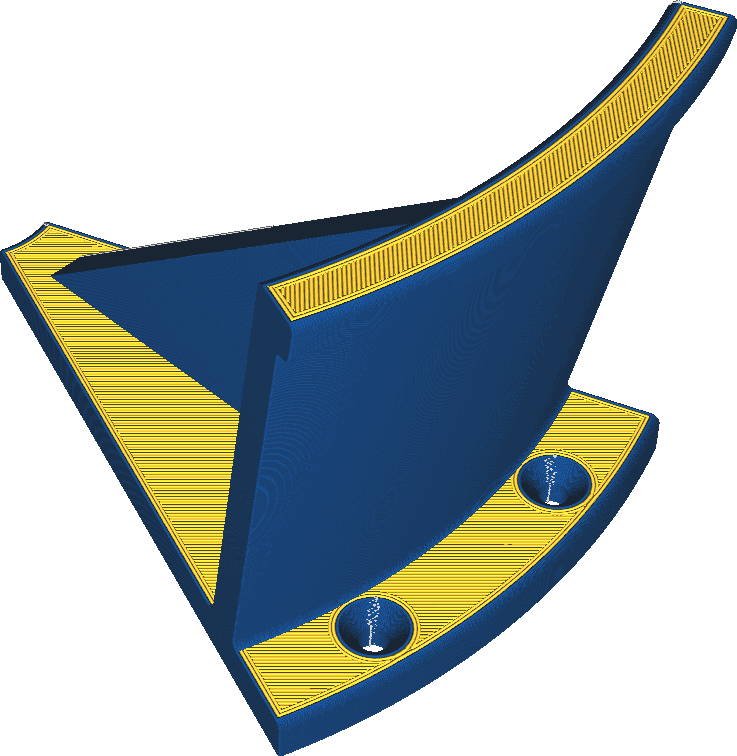

Экструдер внешних стенок
====
Если на вашем принтере установлено несколько экструдеров, можно выбрать один из них для печати внешних стенки.

Печать внешних стенок другим экструдером может понадобиться в следующих случаях:
* Для визуального оформления. Чтобы придать особый и уникальный вид деталям.
* Для печати внешних стен другим материалом, который сможет передать более точную детализацию и не будет подвержен деформации или усадки.
* Для печати внешних стен гибкими материалами чтобы получить другие свойства и характеристики, например улучшить сцепление/трение с сопрягаемыми деталями.
* При печати другими материалами, можно добиться снижения коэффициента трения, что позволит движущим частям лучше скользить по поверхности.

** Если печатать внешнюю стенку другим цветом, одного периметра может быть недостаточно чтобы полностью изменить цвет на детали. Внутренние стенки детали с ярко выраженным цветом может придать внешней стенки иной оттенок.**