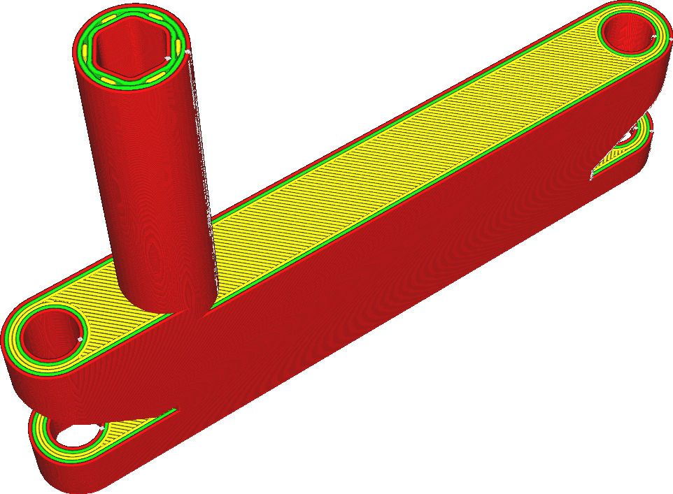

Горизонтальное расширение
====
Этот параметр заставляет модель расширяться или сужаться, компенсируя неточности размеров печати

Положительное значение горизонтального расширения делает печать толще, тем самым уменьшая размер полостей. Отрицательное значение сужает модель, увеличивая в ней отверстие.

Если есть какие то допуски в моделях для печати, данный параметр может быть полезен. Да и из-за небольшой деформации пластика, фактические размеры практически всегда отличаются от эталонных. Эти ошибки можно легко скомпенсировать, просто увеличивая модель с помощью инструмента масштабирования. Но ошибки коррекций некоторых элементов детали можно скомпенсировать именно этой настройкой.

Если вы знаете, что ваш принтер всегда печатает слишком большие детали или есть неточности в его движения, попробуйте компенсировать это с помощью данной настройки.