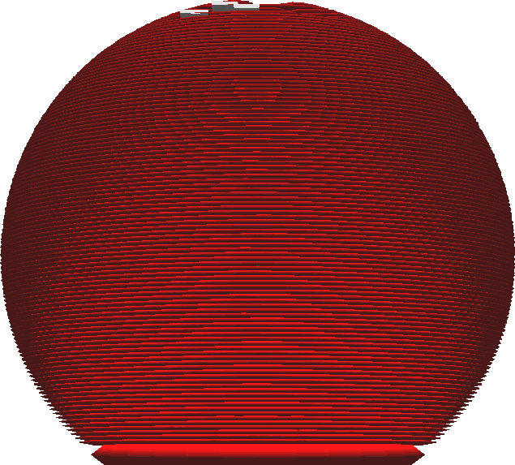

Горизонтальное расширение начального слоя
====
Данный параметр расширяет только первый слой, который лежит непосредственно на поверхности стола (плоту). Аналогично настройке [Горизонтальное расширение](../shell/xy_offset.md), положительное значение делает слой шире, отрицательное наоборот его уменьшает.

Начальный слой печатается непосредственно на нагретой столе, которая на протяжении всей печати поддерживает материал в вязком состоянии, чтобы улучшить адгезию. Начальный слой обычно делают намного толще других, но на это требуется больше материала. Однако, из-за такого метода адгезии линии начинают сильно плыть, выходя за контуры обьекта. Такой дефект получил название "Слоновья нога". Нижняя часть модели (на несколько последующих слоев) получается шире чем на всей детали. Данная настройка помогает убрать этот эффект. Присвойте этому параметру небольшое отрицательное значение чтобы скомпенсировать дефект слоновья нога.

Вы можете присвоить данному параметру положительное значение, чтобы у детали появилось дополнительное поле. Этот параметр можно скомбинировать с другими методами адгезии, например с плотом. 

Все это увеличивает адгезию первого слоя со столом. Но имейте ввиду что это так же приведет к расширению стен первого слоя, поэтому стены последующих слоев могут не совпадать с предыдущими.

**Коомбинация этого параметра с юбкой на самом деле неэффективен, поскольку юбка и так буде создавать большую часть границы на первом слое вокруг детали.**