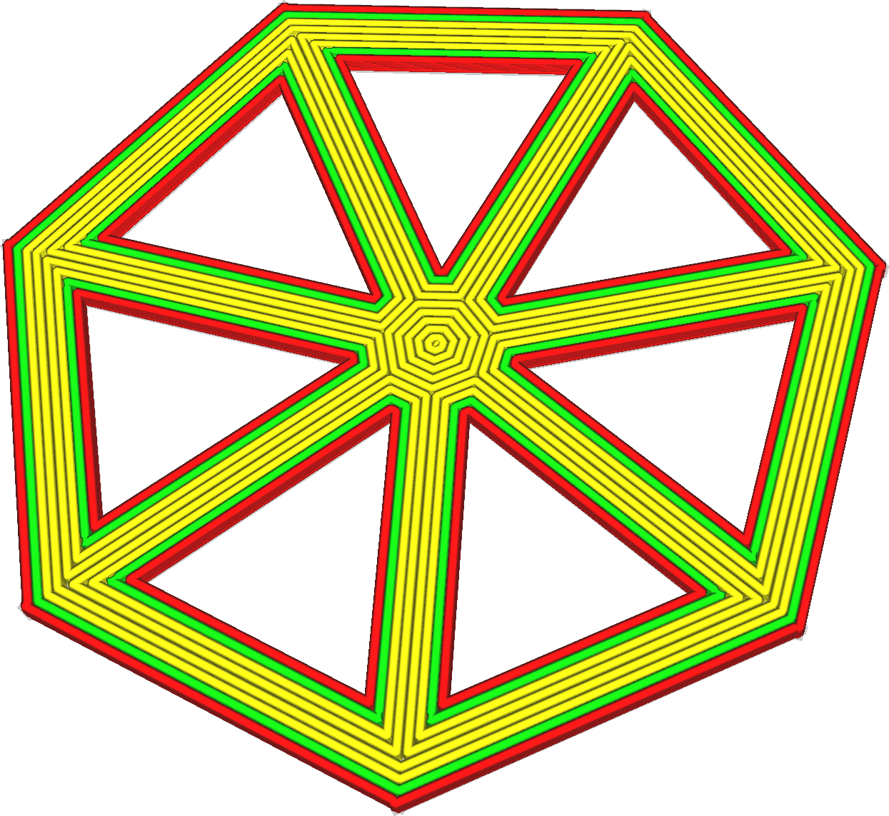

Соединение верхних/нижних полигонов
====
При использовании данного режима с выбранным шаблоном "концентрический" (рисунок замкнутых контуров), линии шаблона становятся связанными между собой.

Режим должен предотвращать появление ненужных перемещений на большие расстояния, что позволит немного сэкономить время. Но при этом создаются углы, из-за которых соплу приходится чаще останавливается и менять свой вектор направления, что может нивелировать все преимущество в скорости. 

Появляется волнистый рисунок, который придает детали интересный эффект.

Контуры, созданые с помощью параметра [Количество внешних дополнительных оболочек](../shell/skin_outline_count.md) не связываются.