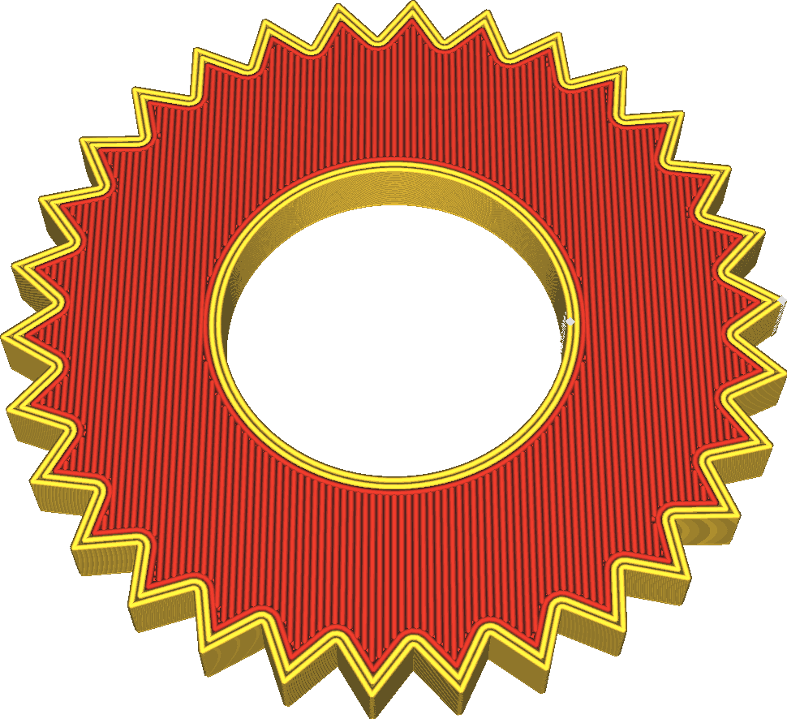

Экструдер дна/крышки
====
Дно и крышка при желании могут быть напечатаны другим экструдером, отличным от основного.

Как можно заметить, данный параметр не влияет на печать стен, для которых установлен свой экструдер. 

Вот несколько примеров, где можно комбинировать экструдеры для печати:
* Для визуального оформления. Чтобы придать особый и уникальный вид деталям .
* Применение более мягких материалов для дна и крышки увеличивает трение. Деталь будет лучше держаться в руках
* При печати твердимы материалами, можно придать детали горизонтальную прочность и сохранить красивый вид поверхности изделия.
* Печать материалами с низким коэффициентом трения делает деталь более износостойким. Движущие части деталей будут меньше истираться.
